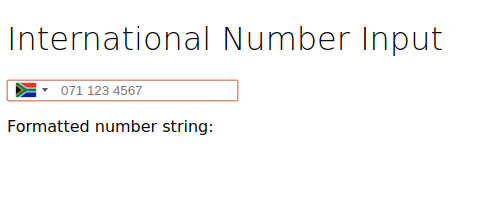

# IntlTelInput

## About

This is an Angular4 implementation of the intl-tel-input jQuery plugin - https://github.com/jackocnr/intl-tel-input

This project was generated with [Angular CLI](https://github.com/angular/angular-cli) version 1.0.0.

## To Use

- Clone and cd into local repo.
- Run 'npm intall'.
- Run `nmp start` for a dev server. 

